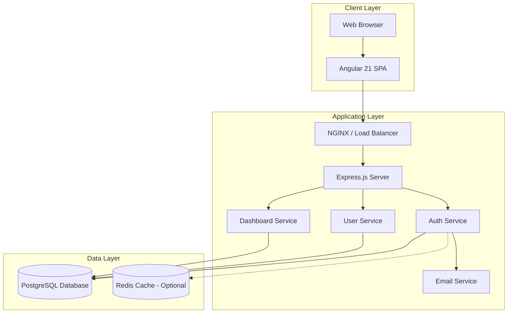
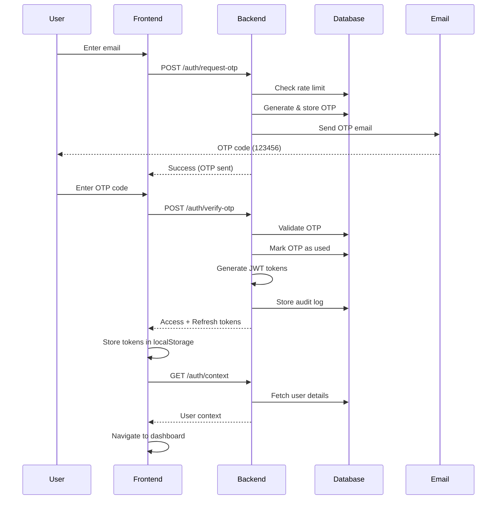
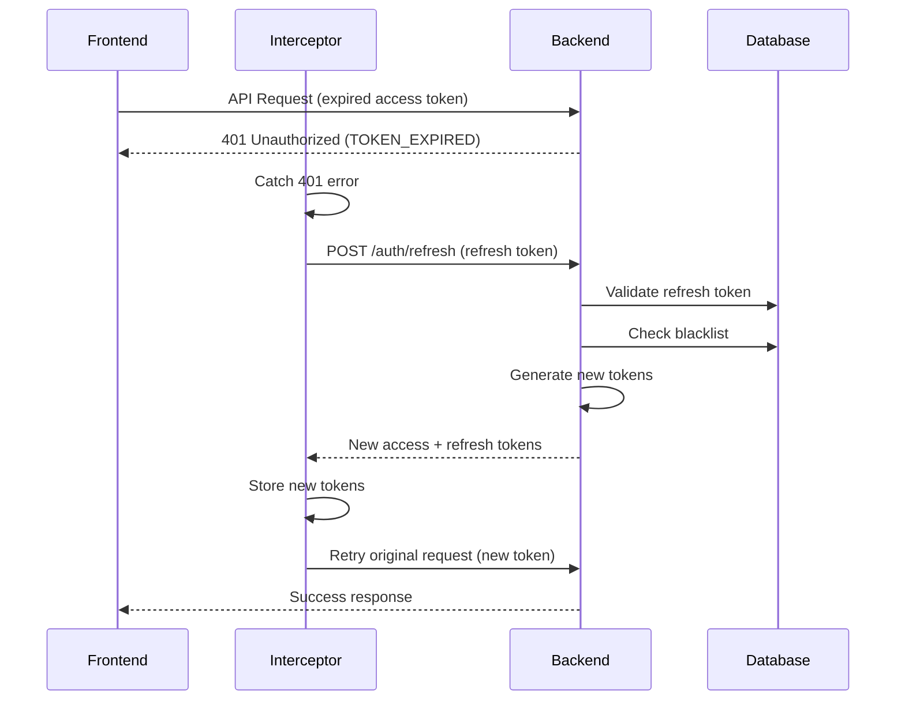
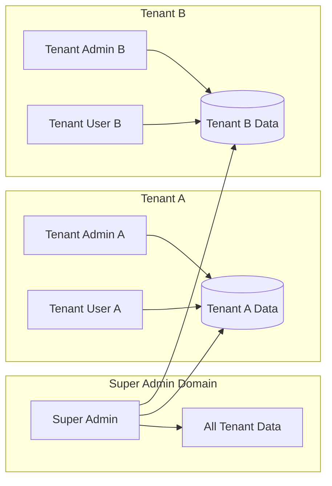
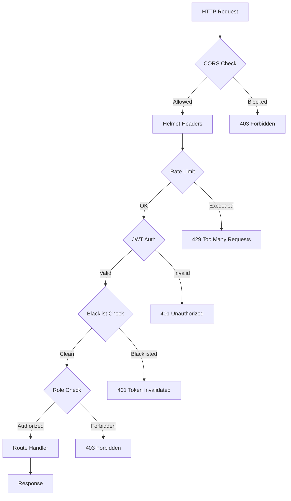

# TMS System - Architecture Documentation

## System Architecture Overview

The TMS (Transport Management System) follows a modern three-tier architecture with clear separation of concerns between presentation, application, and data layers.



## Technology Stack

### Frontend
- **Framework**: Angular 21.0.0
- **Language**: TypeScript 5.x
- **UI Components**: Angular Material 21.0.5
- **Styling**: Tailwind CSS + Custom CSS
- **State Management**: RxJS BehaviorSubject
- **HTTP Client**: Angular HttpClient with interceptors
- **Build Tool**: Angular CLI with Vite

### Backend
- **Runtime**: Node.js 20.19.4
- **Framework**: Express.js 4.18.2
- **Language**: JavaScript (ES6+)
- **Database Driver**: pg (PostgreSQL client)
- **Authentication**: jsonwebtoken (JWT)
- **Email**: nodemailer with Gmail SMTP
- **Security**: helmet, cors, express-rate-limit

### Database
- **DBMS**: PostgreSQL 14+
- **Extensions**: uuid-ossp (UUID generation)
- **Connection**: Connection pooling (max 20)

### DevOps
- **Version Control**: Git
- **Package Manager**: npm 10.8.2
- **Process Manager**: PM2 (recommended for production)
- **Monitoring**: (Future: Prometheus + Grafana)

## Project Structure

```
mscan/
│
├── mscan-server/                    # Backend Node.js Application
│   ├── database/
│   │   ├── schema.sql              # Database schema definition
│   │   ├── seed.sql                # Initial data (super admin)
│   │   └── migrate.js              # Migration runner script
│   │
│   ├── src/
│   │   ├── config/
│   │   │   └── database.js         # PostgreSQL connection pool
│   │   │
│   │   ├── controllers/            # Request handlers
│   │   │   ├── auth.controller.js
│   │   │   ├── user.controller.js
│   │   │   └── dashboard.controller.js
│   │   │
│   │   ├── middleware/             # Express middleware
│   │   │   ├── auth.middleware.js  # JWT verification
│   │   │   └── error.middleware.js # Global error handler
│   │   │
│   │   ├── routes/                 # Route definitions
│   │   │   ├── auth.routes.js
│   │   │   ├── user.routes.js
│   │   │   └── dashboard.routes.js
│   │   │
│   │   ├── services/               # Business logic
│   │   │   ├── otp.service.js      # OTP generation/validation
│   │   │   ├── token.service.js    # JWT management
│   │   │   └── email.service.js    # Email sending
│   │   │
│   │   └── server.js               # Express app entry point
│   │
│   ├── .env                        # Environment configuration
│   ├── package.json
│   └── API.md                      # API documentation
│
└── mscan-client/                    # Frontend Angular Application
    ├── src/
    │   ├── app/
    │   │   ├── components/         # UI components
    │   │   │   ├── login/
    │   │   │   ├── dashboard/
    │   │   │   ├── super-admin-dashboard/
    │   │   │   ├── tenant-dashboard/
    │   │   │   └── customer-registration/
    │   │   │
    │   │   ├── services/           # API services
    │   │   │   ├── auth.service.ts
    │   │   │   ├── user.service.ts
    │   │   │   └── dashboard.service.ts
    │   │   │
    │   │   ├── guards/             # Route guards
    │   │   │   └── auth.guard.ts
    │   │   │
    │   │   ├── interceptors/       # HTTP interceptors
    │   │   │   └── auth.interceptor.ts
    │   │   │
    │   │   ├── models/             # TypeScript interfaces
    │   │   │   └── index.ts
    │   │   │
    │   │   ├── app.config.ts       # App configuration
    │   │   └── app.routes.ts       # Route configuration
    │   │
    │   ├── environments/
    │   │   ├── environment.ts      # Development config
    │   │   └── environment.prod.ts # Production config
    │   │
    │   └── styles.css              # Global styles
    │
    └── package.json
```

## Authentication Flow



## Token Refresh Flow



## Multi-Tenant Architecture



### Data Isolation Rules

1. **Super Admin** (`tenant_id = NULL`):
   - Full system access
   - Can view/manage all tenants
   - Not associated with any tenant

2. **Tenant Admin** (`tenant_id = <UUID>`):
   - Full access to their tenant data
   - Cannot access other tenant data
   - Can manage users in their tenant

3. **Tenant User** (`tenant_id = <UUID>`):
   - Read access to their tenant data
   - Limited permissions based on role
   - Cannot access other tenant data

## Security Architecture

### Authentication Layers

1. **OTP-Based Login**:
   - No password storage
   - 6-digit random codes
   - 5-minute expiry
   - Rate limiting (3 requests per 15 minutes)

2. **JWT Tokens**:
   - Access token: 30 minutes
   - Refresh token: 7 days
   - Unique JTI for each token
   - Blacklist on logout

3. **Authorization**:
   - Role-based access control (RBAC)
   - Middleware validation
   - Permission arrays in user records

### Security Measures



## API Architecture

### RESTful Design Principles

- **Resource-based URLs**: `/users`, `/auth`, `/dashboard`
- **HTTP methods**: GET, POST, PUT, DELETE
- **Stateless**: Each request contains authentication
- **JSON format**: All requests and responses
- **Error handling**: Consistent error response format

### Response Format

```typescript
// Success Response
{
  "success": true,
  "message": "Operation successful",
  "data": { /* resource data */ }
}

// Error Response
{
  "success": false,
  "message": "Error description",
  "code": "ERROR_CODE"
}
```

### API Endpoints Structure

```
/api
├── /health              # Health check
├── /auth
│   ├── /request-otp    # Request OTP
│   ├── /verify-otp     # Verify OTP & login
│   ├── /context        # Get user context
│   ├── /refresh        # Refresh tokens
│   └── /logout         # Logout
├── /users
│   ├── /customers      # Customer management (Super Admin)
│   └── /profile        # User profile
└── /dashboard
    └── /stats          # Dashboard statistics
```

## Deployment Architecture

### Development Environment

```
┌─────────────────┐
│   Developer     │
│   Machine       │
├─────────────────┤
│ Angular Dev     │ :4200
│ (ng serve)      │
├─────────────────┤
│ Node.js Dev     │ :3000
│ (node server.js)│
├─────────────────┤
│ PostgreSQL      │ :5432
│ (local)         │
└─────────────────┘
```

### Production Environment (Recommended)

```
                    ┌──────────────┐
                    │  CloudFlare  │
                    │     CDN      │
                    └──────┬───────┘
                           │
                    ┌──────▼───────┐
                    │    NGINX     │
                    │ Load Balancer│
                    └──────┬───────┘
                           │
          ┌────────────────┼────────────────┐
          │                │                │
    ┌─────▼─────┐   ┌─────▼─────┐   ┌─────▼─────┐
    │  Angular  │   │  Angular  │   │  Angular  │
    │  (Static) │   │  (Static) │   │  (Static) │
    └───────────┘   └───────────┘   └───────────┘
                           │
                    ┌──────▼───────┐
                    │   API GW     │
                    └──────┬───────┘
                           │
          ┌────────────────┼────────────────┐
          │                │                │
    ┌─────▼─────┐   ┌─────▼─────┐   ┌─────▼─────┐
    │  Node.js  │   │  Node.js  │   │  Node.js  │
    │  Instance │   │  Instance │   │  Instance │
    └─────┬─────┘   └─────┬─────┘   └─────┬─────┘
          │                │                │
          └────────────────┼────────────────┘
                           │
                    ┌──────▼───────┐
                    │  PostgreSQL  │
                    │   Primary    │
                    └──────┬───────┘
                           │
                    ┌──────▼───────┐
                    │  PostgreSQL  │
                    │   Replica    │
                    └──────────────┘
```

## Performance Optimization

### Backend Optimizations

1. **Database Connection Pooling**:
   - Max 20 connections
   - Reuse existing connections
   - Automatic connection recycling

2. **Query Optimization**:
   - Indexed columns for lookups
   - Parameterized queries
   - Parallel queries for dashboard

3. **Caching Strategy** (Future):
   - Redis for session data
   - API response caching
   - OTP rate limit in memory

### Frontend Optimizations

1. **Lazy Loading**:
   - Route-based code splitting
   - Component lazy loading
   - Standalone components

2. **State Management**:
   - RxJS for reactive updates
   - Local storage for persistence
   - BehaviorSubject for shared state

3. **Build Optimization**:
   - AOT compilation
   - Tree shaking
   - Minification and compression

## Monitoring & Logging

### Backend Logging

```javascript
// Request logging
app.use((req, res, next) => {
  console.log(`${req.method} ${req.path} - ${req.ip}`);
  next();
});

// Error logging
app.use(errorMiddleware);
```

### Audit Logging

All user actions are logged to `audit_logs` table:
- User ID
- Action type
- Resource affected
- IP address
- Timestamp

### Health Monitoring

```bash
# Health check endpoint
GET /health

Response:
{
  "status": "healthy",
  "timestamp": "2024-12-26T10:30:00.000Z",
  "database": "connected"
}
```

## Scalability Considerations

### Horizontal Scaling

- **Stateless backend**: No session storage in memory
- **Load balancing**: NGINX or AWS ELB
- **Database replicas**: Read replicas for queries
- **CDN**: Static asset distribution

### Vertical Scaling

- **Database tuning**: Connection pool size, query optimization
- **Node.js clustering**: Multiple processes per server
- **Memory management**: Efficient data structures

## Disaster Recovery

### Backup Strategy

1. **Database Backups**:
   - Daily automated backups
   - Point-in-time recovery
   - Off-site storage

2. **Application Backups**:
   - Git repository (code)
   - Environment configurations
   - SSL certificates

### Recovery Plan

1. Restore database from latest backup
2. Deploy application from Git
3. Configure environment variables
4. Verify health checks
5. Resume operations

## Maintenance Windows

**Recommended Schedule**:
- **Database maintenance**: Sunday 2:00 AM - 4:00 AM UTC
- **Application updates**: During low-traffic hours
- **Security patches**: As needed (critical)

---

**Document Version**: 1.0  
**Last Updated**: December 26, 2024  
**Maintained By**: Development Team
