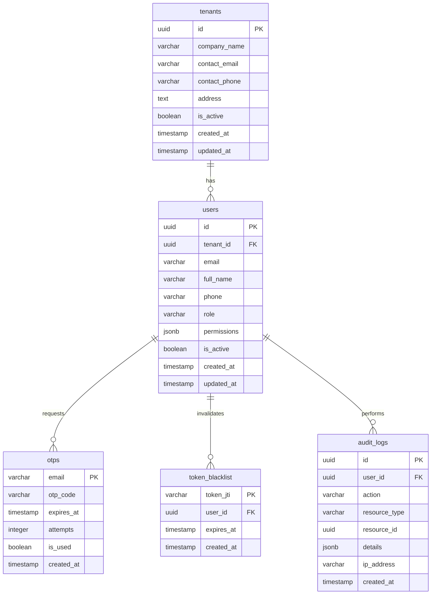

# Database Schema Documentation

## Overview

The TMS (Transport Management System) database uses PostgreSQL with UUID-based primary keys for enhanced security and scalability. The schema supports multi-tenant architecture with data isolation and comprehensive audit logging.

## Entity Relationship Diagram



## Database Tables

### 1. `tenants` Table

**Purpose**: Stores customer/company information for multi-tenant isolation.

| Column | Type | Constraints | Description |
|--------|------|-------------|-------------|
| `id` | UUID | PRIMARY KEY, DEFAULT uuid_generate_v4() | Unique tenant identifier |
| `company_name` | VARCHAR(255) | NOT NULL | Company/organization name |
| `contact_email` | VARCHAR(255) | NOT NULL, UNIQUE | Primary contact email |
| `contact_phone` | VARCHAR(50) | NULL | Contact phone number |
| `address` | TEXT | NULL | Company address |
| `is_active` | BOOLEAN | DEFAULT true | Active status flag |
| `created_at` | TIMESTAMP | DEFAULT CURRENT_TIMESTAMP | Creation timestamp |
| `updated_at` | TIMESTAMP | DEFAULT CURRENT_TIMESTAMP | Last update timestamp |

**Indexes**:
- `idx_tenants_contact_email` ON `contact_email`
- `idx_tenants_is_active` ON `is_active`

**Triggers**:
- `trigger_tenants_updated_at` - Auto-updates `updated_at` on row modification

---

### 2. `users` Table

**Purpose**: Stores user accounts with role-based access control.

| Column | Type | Constraints | Description |
|--------|------|-------------|-------------|
| `id` | UUID | PRIMARY KEY, DEFAULT uuid_generate_v4() | Unique user identifier |
| `tenant_id` | UUID | FOREIGN KEY REFERENCES tenants(id), NULL | Associated tenant (NULL for SUPER_ADMIN) |
| `email` | VARCHAR(255) | NOT NULL, UNIQUE | User email (login identifier) |
| `full_name` | VARCHAR(255) | NOT NULL | User's full name |
| `phone` | VARCHAR(50) | NULL | User phone number |
| `role` | VARCHAR(50) | NOT NULL, CHECK (role IN (...)) | User role (SUPER_ADMIN, TENANT_ADMIN, TENANT_USER) |
| `permissions` | JSONB | DEFAULT '[]' | Array of permission strings |
| `is_active` | BOOLEAN | DEFAULT true | Active status flag |
| `created_at` | TIMESTAMP | DEFAULT CURRENT_TIMESTAMP | Creation timestamp |
| `updated_at` | TIMESTAMP | DEFAULT CURRENT_TIMESTAMP | Last update timestamp |

**Constraints**:
- `CHECK (role IN ('SUPER_ADMIN', 'TENANT_ADMIN', 'TENANT_USER'))`
- `CHECK (role != 'SUPER_ADMIN' OR tenant_id IS NULL)` - Super admins cannot have tenant_id
- `CHECK (role = 'SUPER_ADMIN' OR tenant_id IS NOT NULL)` - Non-super admins must have tenant_id

**Indexes**:
- `idx_users_email` ON `email`
- `idx_users_tenant_id` ON `tenant_id`
- `idx_users_role` ON `role`

**Triggers**:
- `trigger_users_updated_at` - Auto-updates `updated_at` on row modification

---

### 3. `otps` Table

**Purpose**: Temporary storage for one-time password authentication codes.

| Column | Type | Constraints | Description |
|--------|------|-------------|-------------|
| `email` | VARCHAR(255) | PRIMARY KEY | Email address for OTP |
| `otp_code` | VARCHAR(6) | NOT NULL | 6-digit OTP code |
| `expires_at` | TIMESTAMP | NOT NULL | Expiration timestamp (5 minutes) |
| `attempts` | INTEGER | DEFAULT 0 | Verification attempt count |
| `is_used` | BOOLEAN | DEFAULT false | Whether OTP has been used |
| `created_at` | TIMESTAMP | DEFAULT CURRENT_TIMESTAMP | Creation timestamp |

**Indexes**:
- `idx_otps_expires_at` ON `expires_at`

**Notes**:
- OTPs expire after 5 minutes
- Maximum 3 verification attempts per OTP
- Single-use only (is_used flag)
- Old OTPs are replaced when new ones are generated

---

### 4. `token_blacklist` Table

**Purpose**: Stores invalidated JWT tokens (logout, security revocation).

| Column | Type | Constraints | Description |
|--------|------|-------------|-------------|
| `token_jti` | VARCHAR(255) | PRIMARY KEY | JWT ID (unique token identifier) |
| `user_id` | UUID | FOREIGN KEY REFERENCES users(id) | User who owned the token |
| `expires_at` | TIMESTAMP | NOT NULL | Original token expiration |
| `created_at` | TIMESTAMP | DEFAULT CURRENT_TIMESTAMP | Blacklist timestamp |

**Indexes**:
- `idx_token_blacklist_user_id` ON `user_id`
- `idx_token_blacklist_expires_at` ON `expires_at`

**Notes**:
- Both access and refresh tokens are blacklisted on logout
- Expired tokens can be periodically cleaned up
- Checked during token validation to prevent reuse

---

### 5. `audit_logs` Table

**Purpose**: Comprehensive audit trail for all system actions.

| Column | Type | Constraints | Description |
|--------|------|-------------|-------------|
| `id` | UUID | PRIMARY KEY, DEFAULT uuid_generate_v4() | Unique log identifier |
| `user_id` | UUID | FOREIGN KEY REFERENCES users(id), NULL | User who performed action |
| `action` | VARCHAR(100) | NOT NULL | Action type (e.g., 'LOGIN', 'CREATE_CUSTOMER') |
| `resource_type` | VARCHAR(50) | NULL | Type of resource affected |
| `resource_id` | UUID | NULL | ID of affected resource |
| `details` | JSONB | NULL | Additional action details |
| `ip_address` | VARCHAR(50) | NULL | Client IP address |
| `created_at` | TIMESTAMP | DEFAULT CURRENT_TIMESTAMP | Action timestamp |

**Indexes**:
- `idx_audit_logs_user_id` ON `user_id`
- `idx_audit_logs_action` ON `action`
- `idx_audit_logs_created_at` ON `created_at`

**Common Actions**:
- `LOGIN` - User authentication
- `LOGOUT` - User logout
- `CREATE_CUSTOMER` - Customer registration
- `UPDATE_PROFILE` - Profile modification
- `REQUEST_OTP` - OTP generation
- `VERIFY_OTP` - OTP verification

---

## Relationships

### One-to-Many Relationships

1. **tenants → users**
   - One tenant can have many users
   - Constraint: `users.tenant_id` references `tenants.id`
   - On Delete: CASCADE (when tenant deleted, users deleted)

2. **users → otps**
   - One user can have multiple OTP records (historical)
   - Relationship by email (not FK)
   - Old OTPs replaced on new generation

3. **users → token_blacklist**
   - One user can have many blacklisted tokens
   - Constraint: `token_blacklist.user_id` references `users.id`
   - On Delete: CASCADE

4. **users → audit_logs**
   - One user can have many audit log entries
   - Constraint: `audit_logs.user_id` references `users.id`
   - On Delete: SET NULL (preserve logs)

---

## Data Isolation Strategy

### Multi-Tenant Isolation

1. **Super Admin Access**:
   - `tenant_id IS NULL`
   - Can access all tenant data
   - Not associated with any specific tenant

2. **Tenant User Access**:
   - `tenant_id = <specific_tenant>`
   - Queries automatically filtered by tenant_id
   - Cannot access other tenant data

3. **Query Pattern**:
   ```sql
   -- For tenant users
   SELECT * FROM users WHERE tenant_id = $1;
   
   -- For super admin
   SELECT * FROM users; -- No tenant filter
   ```

---

## Seed Data

### Initial Super Admin

```sql
INSERT INTO users (id, tenant_id, email, full_name, role, permissions, is_active)
VALUES (
  uuid_generate_v4(),
  NULL,
  'admin@mscan.com',
  'System Administrator',
  'SUPER_ADMIN',
  '["manage_customers", "manage_users", "view_all_data", "system_settings"]',
  true
);
```

**Credentials**:
- Email: `admin@mscan.com`
- Authentication: OTP-based (no password)

---

## Indexes Strategy

### Performance Optimization

1. **Email Lookups** (users, tenants):
   - Frequent authentication queries
   - Index on email columns for fast lookups

2. **Tenant Filtering** (users):
   - Multi-tenant queries use tenant_id
   - Index ensures fast filtering

3. **OTP Validation**:
   - Index on expires_at for cleanup queries
   - Primary key on email for direct access

4. **Token Blacklist**:
   - Index on token_jti for validation
   - Index on expires_at for cleanup

5. **Audit Logs**:
   - Index on user_id for user history
   - Index on created_at for time-based queries
   - Index on action for filtering

---

## Triggers

### Auto-Update Timestamps

```sql
CREATE OR REPLACE FUNCTION update_updated_at_column()
RETURNS TRIGGER AS $$
BEGIN
    NEW.updated_at = CURRENT_TIMESTAMP;
    RETURN NEW;
END;
$$ LANGUAGE plpgsql;

-- Applied to: tenants, users
```

**Purpose**: Automatically updates `updated_at` column on row modification.

---

## Security Features

### 1. Password-less Authentication
- No password storage in database
- OTP-based authentication only
- Reduces password breach risks

### 2. Token Management
- JWT tokens with expiry
- Blacklist mechanism for invalidated tokens
- Separate access and refresh tokens

### 3. Role-Based Access Control
- CHECK constraints enforce valid roles
- Super admin isolation (tenant_id NULL)
- Permissions stored as JSONB array

### 4. Audit Trail
- All actions logged
- IP address tracking
- Immutable log records (no updates)

### 5. Data Validation
- Email uniqueness enforced
- Contact email uniqueness for tenants
- Role validation via CHECK constraints

---

## Maintenance Queries

### Cleanup Expired OTPs
```sql
DELETE FROM otps WHERE expires_at < CURRENT_TIMESTAMP;
```

### Cleanup Expired Blacklisted Tokens
```sql
DELETE FROM token_blacklist WHERE expires_at < CURRENT_TIMESTAMP;
```

### View Active Sessions (24h)
```sql
SELECT DISTINCT user_id, COUNT(*) as actions
FROM audit_logs
WHERE created_at > CURRENT_TIMESTAMP - INTERVAL '24 hours'
  AND action = 'LOGIN'
GROUP BY user_id;
```

### Tenant User Count
```sql
SELECT t.company_name, COUNT(u.id) as user_count
FROM tenants t
LEFT JOIN users u ON t.id = u.tenant_id
GROUP BY t.id, t.company_name
ORDER BY user_count DESC;
```

---

## Migration Scripts

### Initial Setup
```bash
# Create database
PGPASSWORD=admin psql -U postgres -c "CREATE DATABASE mscan_db;"

# Run schema migration
cd mscan-server
node database/migrate.js
```

### Backup Strategy
```bash
# Backup database
pg_dump -U postgres -d mscan_db -F c -f backup_$(date +%Y%m%d).dump

# Restore database
pg_restore -U postgres -d mscan_db -c backup_20241226.dump
```

---

## Performance Metrics

### Expected Query Performance

| Query Type | Expected Time | Notes |
|------------|--------------|-------|
| User login (email lookup) | < 10ms | Indexed email column |
| OTP validation | < 20ms | Primary key lookup + timestamp check |
| Token blacklist check | < 10ms | Indexed token_jti |
| Dashboard stats (tenant) | < 100ms | Aggregation on indexed columns |
| Dashboard stats (admin) | < 200ms | Cross-tenant aggregation |
| Audit log insert | < 5ms | Simple insert, async |

### Scalability Considerations

- **Connection Pooling**: Configured in `database.js` (max 20 connections)
- **Index Coverage**: All foreign keys and frequently queried columns indexed
- **JSONB Performance**: Permissions stored as JSONB for flexible querying
- **Cleanup Jobs**: Scheduled jobs to remove expired OTPs and tokens

---

## Schema Version

**Version**: 1.0  
**Last Updated**: December 26, 2024  
**Database**: PostgreSQL 14+  
**Extensions**: uuid-ossp

---

## Future Schema Enhancements

### Planned Features
- [ ] User profile pictures (add `avatar_url` column)
- [ ] Multi-factor authentication (new `mfa_settings` table)
- [ ] User invitations (new `invitations` table)
- [ ] File uploads (new `documents` table)
- [ ] Real-time notifications (new `notifications` table)
- [ ] User sessions (new `sessions` table)
- [ ] API rate limiting (new `rate_limits` table)

### Optimization Opportunities
- [ ] Partitioning for audit_logs by date
- [ ] Materialized views for dashboard stats
- [ ] Read replicas for reporting queries
- [ ] Archived tables for historical data
