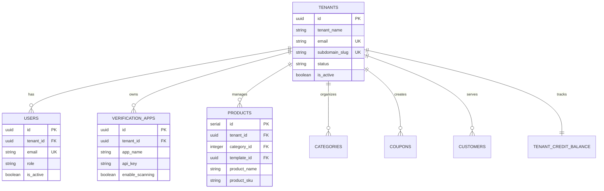
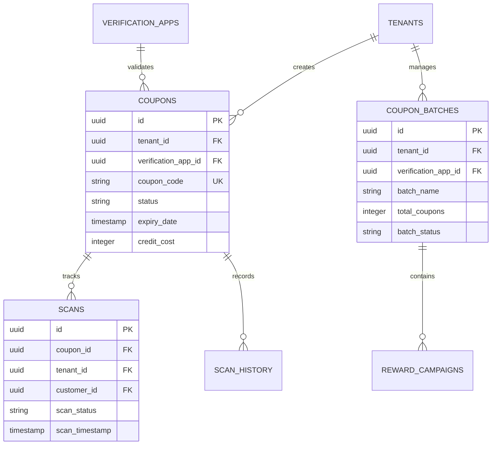
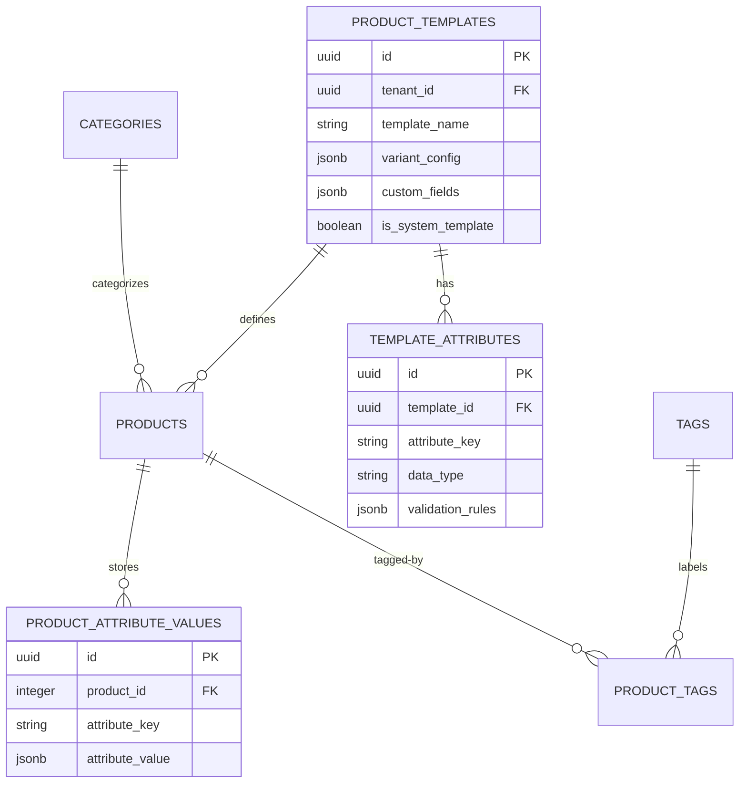
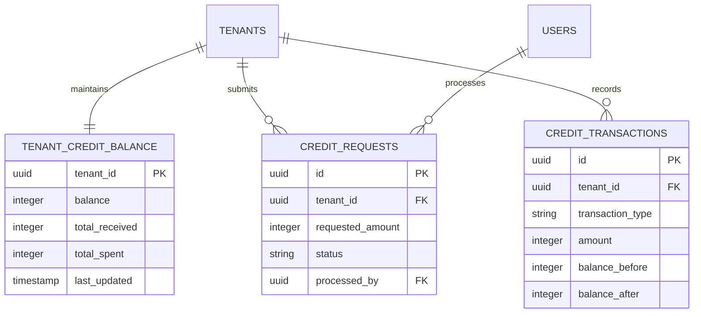
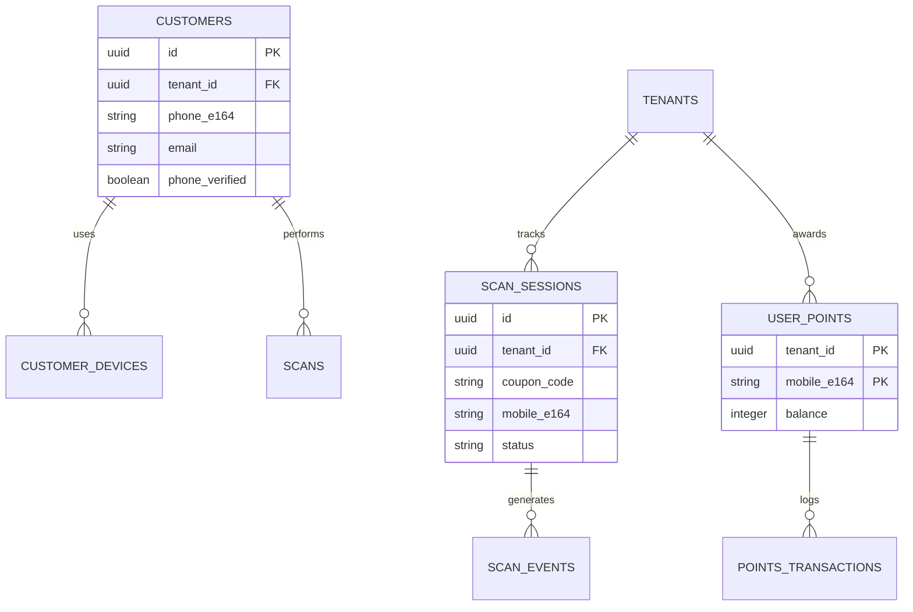

# Database Design Documentation

## Overview

**Database System:** PostgreSQL 16.x
**Architecture:** Multi-tenant with row-level isolation
**Schema Version:** 1.0
**Last Updated:** 2026-01-26

The MScan platform uses a PostgreSQL database with a multi-tenant architecture where each tenant (business/organization) has isolated data within shared tables. Data isolation is enforced through `tenant_id` foreign keys and application-level access controls.

### Key Design Principles

1. **Multi-tenancy**: All core tables include `tenant_id` for data isolation
2. **UUID Primary Keys**: Most tables use UUID for globally unique identifiers
3. **Soft Deletes**: Implemented via `is_active` flags where applicable
4. **Audit Trail**: Comprehensive audit logging and timestamp tracking
5. **JSONB Flexibility**: Dynamic attributes stored in JSONB columns for extensibility
6. **Referential Integrity**: Foreign key constraints with appropriate cascade behaviors

---

## Entity Relationship Diagrams

### Core System Architecture



### Coupon & Rewards System



### Product Catalog & Templates



### Credit Management System



### Mobile Scanning & Points System



---

## Table Definitions

### Core System Tables

#### TENANTS

**Purpose:** Central tenant/organization management table. Each tenant represents a business using the platform.

| Column | Type | Constraints | Default | Description |
|--------|------|-------------|---------|-------------|
| id | UUID | PRIMARY KEY | gen_random_uuid() | Unique tenant identifier |
| tenant_name | VARCHAR(255) | NOT NULL | - | Business/organization name |
| email | VARCHAR(255) | NOT NULL, UNIQUE | - | Primary contact email |
| phone | VARCHAR(50) | - | - | Contact phone number |
| address | TEXT | - | - | Business address |
| contact_name | VARCHAR(255) | - | - | Primary contact person name |
| contact_person | VARCHAR(255) | - | - | Alternate contact person |
| subdomain_slug | VARCHAR(100) | NOT NULL, UNIQUE | - | URL-safe subdomain identifier |
| status | VARCHAR(20) | CHECK | 'active' | Tenant status (active/inactive) |
| is_active | BOOLEAN | - | true | Active flag |
| created_by | UUID | FK → users(id) | - | User who created tenant |
| created_at | TIMESTAMPTZ | - | CURRENT_TIMESTAMP | Creation timestamp |
| updated_at | TIMESTAMPTZ | - | CURRENT_TIMESTAMP | Last update timestamp |

**Constraints:**
- `check_subdomain_slug_format`: Validates subdomain format `^[a-z0-9][a-z0-9-]{1,48}[a-z0-9]$`
- `tenants_status_check`: Status must be 'active' or 'inactive'

**Indexes:**
- `idx_tenants_email` on (email)
- `idx_tenants_status` on (status)
- `idx_tenants_contact_email` on (email)
- `idx_tenants_subdomain_slug` on (subdomain_slug) WHERE subdomain_slug IS NOT NULL

**Triggers:**
- `update_tenants_updated_at`: Auto-updates updated_at on row modification

---

#### USERS

**Purpose:** System users with role-based access (Super Admin, Tenant Admin, Tenant User)

| Column | Type | Constraints | Default | Description |
|--------|------|-------------|---------|-------------|
| id | UUID | PRIMARY KEY | gen_random_uuid() | Unique user identifier |
| tenant_id | UUID | FK → tenants(id) ON DELETE CASCADE | - | Associated tenant (NULL for super admins) |
| email | VARCHAR(255) | NOT NULL, UNIQUE | - | User email (login identifier) |
| full_name | VARCHAR(255) | NOT NULL | - | User's full name |
| phone | VARCHAR(50) | - | - | Contact phone |
| role | VARCHAR(50) | NOT NULL, CHECK | - | User role |
| is_active | BOOLEAN | - | true | Account active status |
| created_at | TIMESTAMPTZ | - | CURRENT_TIMESTAMP | Account creation time |
| updated_at | TIMESTAMPTZ | - | CURRENT_TIMESTAMP | Last update time |

**Valid Roles:**
- `SUPER_ADMIN`: Platform administrator (tenant_id must be NULL)
- `TENANT_ADMIN`: Tenant administrator
- `TENANT_USER`: Regular tenant user

**Constraints:**
- `check_super_admin_no_tenant`: Enforces SUPER_ADMIN has no tenant_id, others must have tenant_id

**Indexes:**
- `idx_users_email` on (email)
- `idx_users_tenant_id` on (tenant_id)
- `idx_users_role` on (role)

**Triggers:**
- `update_users_updated_at`: Auto-updates updated_at on row modification

---

#### OTPS

**Purpose:** Email-based OTP authentication for user login

| Column | Type | Constraints | Default | Description |
|--------|------|-------------|---------|-------------|
| id | UUID | PRIMARY KEY | gen_random_uuid() | Unique OTP record ID |
| email | VARCHAR(255) | NOT NULL | - | Email address for OTP |
| otp_code | VARCHAR(6) | NOT NULL | - | 6-digit OTP code |
| expires_at | TIMESTAMPTZ | NOT NULL | - | OTP expiration time |
| attempts | INTEGER | - | 0 | Number of verification attempts |
| is_used | BOOLEAN | - | false | Whether OTP has been used |
| created_at | TIMESTAMPTZ | - | CURRENT_TIMESTAMP | OTP generation time |

**Constraints:**
- `unique_active_otp`: Ensures unique (email, otp_code) combination

**Indexes:**
- `idx_otps_email` on (email)
- `idx_otps_expires_at` on (expires_at)
- `idx_otps_email_not_used` on (email, is_used) WHERE is_used = false

---

#### TOKEN_BLACKLIST

**Purpose:** Tracks invalidated JWT tokens for logout and security

| Column | Type | Constraints | Default | Description |
|--------|------|-------------|---------|-------------|
| id | UUID | PRIMARY KEY | gen_random_uuid() | Unique record ID |
| token_jti | VARCHAR(255) | NOT NULL, UNIQUE | - | JWT Token ID (JTI claim) |
| user_id | UUID | NOT NULL, FK → users(id) ON DELETE CASCADE | - | User who owned the token |
| token_type | VARCHAR(20) | NOT NULL, CHECK | - | Token type (ACCESS/REFRESH) |
| expires_at | TIMESTAMPTZ | NOT NULL | - | Original token expiration |
| blacklisted_at | TIMESTAMPTZ | - | CURRENT_TIMESTAMP | When token was blacklisted |

**Constraints:**
- Token type must be 'ACCESS' or 'REFRESH'

**Indexes:**
- `idx_token_blacklist_jti` on (token_jti)
- `idx_token_blacklist_expires_at` on (expires_at)

---

#### AUDIT_LOGS

**Purpose:** Comprehensive audit trail for all system actions

| Column | Type | Constraints | Default | Description |
|--------|------|-------------|---------|-------------|
| id | UUID | PRIMARY KEY | gen_random_uuid() | Unique log entry ID |
| user_id | UUID | FK → users(id) ON DELETE SET NULL | - | User who performed action |
| action | VARCHAR(100) | NOT NULL | - | Action performed |
| resource_type | VARCHAR(100) | - | - | Type of resource affected |
| resource_id | UUID | - | - | ID of affected resource |
| ip_address | VARCHAR(45) | - | - | Client IP address |
| user_agent | TEXT | - | - | Client user agent string |
| created_at | TIMESTAMPTZ | - | CURRENT_TIMESTAMP | When action occurred |

**Indexes:**
- `idx_audit_logs_user_id` on (user_id)
- `idx_audit_logs_created_at` on (created_at)

---

### Customer Management Tables

#### CUSTOMERS

**Purpose:** End-user customers who scan coupons and earn rewards

| Column | Type | Constraints | Default | Description |
|--------|------|-------------|---------|-------------|
| id | UUID | PRIMARY KEY | gen_random_uuid() | Unique customer ID |
| tenant_id | UUID | NOT NULL, FK → tenants(id) ON DELETE CASCADE | - | Associated tenant |
| phone_e164 | VARCHAR(20) | - | - | Phone in E.164 format (+country code) |
| email | VARCHAR(255) | - | - | Customer email |
| full_name | VARCHAR(120) | - | - | Customer full name |
| phone_verified | BOOLEAN | - | false | Phone verification status |
| email_verified | BOOLEAN | - | false | Email verification status |
| created_at | TIMESTAMPTZ | - | CURRENT_TIMESTAMP | Account creation time |
| updated_at | TIMESTAMPTZ | - | CURRENT_TIMESTAMP | Last update time |

**Constraints:**
- `chk_phone_or_email`: At least one of phone_e164 or email must be provided
- `uq_tenant_phone`: Unique (tenant_id, phone_e164)
- `uq_tenant_email`: Unique (tenant_id, email)

**Indexes:**
- `idx_customers_tenant` on (tenant_id)

---

#### CUSTOMER_DEVICES

**Purpose:** Track devices used by customers for security and analytics

| Column | Type | Constraints | Default | Description |
|--------|------|-------------|---------|-------------|
| id | UUID | PRIMARY KEY | gen_random_uuid() | Unique device record ID |
| customer_id | UUID | NOT NULL, FK → customers(id) ON DELETE CASCADE | - | Associated customer |
| tenant_id | UUID | NOT NULL, FK → tenants(id) ON DELETE CASCADE | - | Associated tenant |
| device_id | TEXT | NOT NULL | - | Device identifier (fingerprint/UUID) |
| last_seen | TIMESTAMPTZ | - | CURRENT_TIMESTAMP | Last activity timestamp |
| created_at | TIMESTAMPTZ | - | CURRENT_TIMESTAMP | First seen timestamp |

**Indexes:**
- `idx_customer_devices_cust` on (customer_id)
- `idx_customer_devices_tenant` on (tenant_id)

---

### Verification Apps Tables

#### VERIFICATION_APPS

**Purpose:** External applications configured to verify coupons (mobile apps, web portals, etc.)

| Column | Type | Constraints | Default | Description |
|--------|------|-------------|---------|-------------|
| id | UUID | PRIMARY KEY | gen_random_uuid() | Unique app ID |
| tenant_id | UUID | NOT NULL, FK → tenants(id) ON DELETE CASCADE | - | Owning tenant |
| app_name | VARCHAR(255) | NOT NULL | - | Application name |
| code | VARCHAR(100) | - | - | Short code identifier |
| api_key | VARCHAR(255) | - | - | API authentication key |
| display_name | VARCHAR(255) | - | - | Display name for UI |
| description | TEXT | - | - | App description |
| business_type | VARCHAR(100) | - | - | Type of business/industry |
| logo_url | TEXT | - | - | URL to app logo |
| primary_color | VARCHAR(7) | - | - | Hex color code for branding |
| secondary_color | VARCHAR(7) | - | - | Secondary hex color |
| welcome_message | TEXT | - | - | Welcome message for users |
| scan_success_message | TEXT | - | 'Coupon verified successfully!' | Success message |
| scan_failure_message | TEXT | - | 'Invalid or expired coupon.' | Failure message |
| post_scan_redirect_url | TEXT | - | - | URL to redirect after scan |
| enable_scanning | BOOLEAN | - | true | Enable/disable scanning |
| is_active | BOOLEAN | - | true | App active status |
| created_at | TIMESTAMPTZ | - | CURRENT_TIMESTAMP | Creation time |
| updated_at | TIMESTAMPTZ | - | CURRENT_TIMESTAMP | Last update time |

**Indexes:**
- `idx_verification_apps_tenant` on (tenant_id)

**Triggers:**
- `update_verification_apps_updated_at`: Auto-updates updated_at on modification

---

### Coupon Management Tables

#### COUPONS

**Purpose:** Core coupon/voucher records with discount rules and lifecycle management

| Column | Type | Constraints | Default | Description |
|--------|------|-------------|---------|-------------|
| id | UUID | PRIMARY KEY | gen_random_uuid() | Unique coupon ID |
| tenant_id | UUID | NOT NULL, FK → tenants(id) ON DELETE CASCADE | - | Owning tenant |
| verification_app_id | UUID | FK → verification_apps(id) ON DELETE SET NULL | - | Associated verification app |
| coupon_code | VARCHAR(50) | UNIQUE, NOT NULL | - | Unique coupon code |
| discount_type | VARCHAR(20) | NOT NULL, CHECK | - | Type of discount |
| discount_value | DECIMAL(10,2) | NOT NULL, CHECK > 0 | - | Discount amount/percentage |
| discount_currency | VARCHAR(3) | - | 'USD' | Currency code (ISO 4217) |
| buy_quantity | INTEGER | CHECK > 0 or NULL | - | Buy quantity for BUY_X_GET_Y |
| get_quantity | INTEGER | CHECK > 0 or NULL | - | Get quantity for BUY_X_GET_Y |
| min_purchase_amount | DECIMAL(10,2) | CHECK >= 0 or NULL | - | Minimum purchase requirement |
| expiry_date | TIMESTAMPTZ | NOT NULL | - | Coupon expiration date |
| total_usage_limit | INTEGER | NOT NULL, CHECK > 0 | 1 | Total redemptions allowed |
| per_user_usage_limit | INTEGER | NOT NULL, CHECK > 0 | 1 | Redemptions per user |
| max_scans_per_code | INTEGER | NOT NULL, CHECK > 0 | 1 | Max scans per code |
| current_usage_count | INTEGER | CHECK >= 0 | 0 | Current redemption count |
| status | VARCHAR(20) | CHECK | 'draft' | Coupon lifecycle status |
| qr_code_url | TEXT | - | - | URL to QR code image |
| description | TEXT | - | - | Coupon description |
| terms | TEXT | - | - | Terms and conditions |
| credit_cost | INTEGER | NOT NULL, CHECK > 0 | - | Credits required to create |
| batch_id | UUID | - | - | Batch grouping ID |
| batch_quantity | INTEGER | - | - | Total in batch (stored on first) |
| code_type | VARCHAR(20) | CHECK | 'random' | Code generation type |
| code_prefix | VARCHAR(20) | - | - | Prefix for sequential codes |
| coupon_reference | VARCHAR(20) | UNIQUE | - | Human-readable reference |
| product_id | INTEGER | FK → products(id) ON DELETE SET NULL | - | Associated product |
| product_name | VARCHAR(255) | - | - | Product name snapshot |
| product_sku | VARCHAR(100) | - | - | Product SKU snapshot |
| coupon_points | INTEGER | - | - | Points awarded on scan |
| serial_number | INTEGER | - | - | Serial number for tracking |
| campaign_id | UUID | FK → reward_campaigns(id) ON DELETE SET NULL | - | Associated campaign |
| reward_amount | DECIMAL(10,2) | - | 0 | Reward amount |
| printed_at | TIMESTAMPTZ | - | - | When coupon was printed |
| activated_at | TIMESTAMPTZ | - | - | When coupon was activated |
| printed_count | INTEGER | - | 0 | Number of times printed |
| activation_note | TEXT | - | - | Notes on activation |
| deactivation_reason | TEXT | - | - | Reason for deactivation |
| created_at | TIMESTAMPTZ | - | CURRENT_TIMESTAMP | Creation time |
| updated_at | TIMESTAMPTZ | - | CURRENT_TIMESTAMP | Last update time |

**Valid Discount Types:**
- `PERCENTAGE`: Percentage-based discount
- `FIXED_AMOUNT`: Fixed amount discount
- `BUY_X_GET_Y`: Buy X get Y offer

**Valid Status Values:**
- `draft`: Created but not yet printed
- `printed`: Printed but not activated
- `active`: Available for use
- `used`: Successfully redeemed
- `inactive`: Manually deactivated
- `expired`: Past expiration date
- `exhausted`: Usage limit reached

**Valid Code Types:**
- `random`: Randomly generated codes
- `sequential`: Sequential codes with prefix

**Constraints:**
- `chk_expiry_future`: expiry_date must be > created_at
- `chk_buy_get_consistency`: BUY_X_GET_Y requires both buy_quantity and get_quantity
- `chk_total_usage_limit_positive`: total_usage_limit > 0
- `chk_per_user_usage_limit_positive`: per_user_usage_limit > 0
- `chk_max_scans_per_code_positive`: max_scans_per_code > 0
- `coupons_status_check`: Status must be one of valid status values

**Indexes:**
- `idx_coupons_tenant` on (tenant_id)
- `idx_coupons_code` on (coupon_code)
- `idx_coupons_status` on (status)
- `idx_coupons_expiry` on (expiry_date)
- `idx_coupons_app` on (verification_app_id)
- `idx_coupons_created_at` on (created_at)
- `idx_coupons_batch` on (batch_id)
- `idx_coupons_scan_limit` on (max_scans_per_code) WHERE max_scans_per_code IS NOT NULL
- `idx_coupons_code_type` on (code_type)
- `idx_coupons_code_prefix` on (tenant_id, code_prefix) WHERE code_prefix IS NOT NULL
- `idx_coupons_reference` on (coupon_reference)
- `idx_coupons_tenant_reference` on (tenant_id, coupon_reference)
- `idx_coupons_product` on (product_id)
- `idx_coupons_product_sku` on (product_sku)
- `idx_coupons_product_name` on (product_name)
- `idx_coupons_points` on (coupon_points)
- `idx_coupons_serial` on (serial_number)
- `idx_coupons_campaign` on (campaign_id)
- `idx_coupons_status_lifecycle` on (status) WHERE status IN ('draft', 'printed', 'active')
- `idx_coupons_printed_at` on (printed_at)
- `idx_coupons_activated_at` on (activated_at)

**Triggers:**
- `update_coupons_updated_at`: Auto-updates updated_at
- `trigger_update_coupon_status`: Auto-updates status based on expiry/usage
- `trigger_validate_coupon_status_transition`: Validates status transitions

---

#### COUPON_BATCHES

**Purpose:** Groups related coupons for batch operations and tracking

| Column | Type | Constraints | Default | Description |
|--------|------|-------------|---------|-------------|
| id | UUID | PRIMARY KEY | gen_random_uuid() | Unique batch ID |
| tenant_id | UUID | NOT NULL, FK → tenants(id) ON DELETE CASCADE | - | Owning tenant |
| verification_app_id | UUID | FK → verification_apps(id) ON DELETE SET NULL | - | Associated app |
| batch_name | VARCHAR(255) | NOT NULL | - | Batch name |
| dealer_name | VARCHAR(255) | - | - | Dealer/distributor name |
| zone | VARCHAR(100) | - | - | Geographic zone |
| total_coupons | INTEGER | NOT NULL, CHECK > 0 | - | Total coupons in batch |
| serial_number_start | INTEGER | - | - | Starting serial number |
| serial_number_end | INTEGER | - | - | Ending serial number |
| batch_status | VARCHAR(50) | - | 'draft' | Batch lifecycle status |
| activated_at | TIMESTAMP | - | - | Batch activation time |
| activation_note | TEXT | - | - | Activation notes |
| created_at | TIMESTAMPTZ | - | CURRENT_TIMESTAMP | Creation time |
| updated_at | TIMESTAMPTZ | - | CURRENT_TIMESTAMP | Last update time |

**Batch Status Values:**
- `draft`: Created but not assigned codes
- `code_assigned`: Codes assigned but not activated
- `activated`: Batch activated and live
- `live`: Currently active
- `completed`: Batch completed/expired

**Indexes:**
- `idx_coupon_batches_tenant` on (tenant_id)
- `idx_coupon_batches_status` on (batch_status)
- `idx_coupon_batches_created_at` on (created_at)
- `idx_batches_status` on (batch_status)
- `idx_batches_dealer` on (dealer_name)

**Triggers:**
- `update_coupon_batches_updated_at`: Auto-updates updated_at

---

#### COUPON_CODE_SEQUENCES

**Purpose:** Manages sequential coupon code generation

| Column | Type | Constraints | Default | Description |
|--------|------|-------------|---------|-------------|
| id | UUID | PRIMARY KEY | gen_random_uuid() | Unique sequence ID |
| tenant_id | UUID | NOT NULL, FK → tenants(id) ON DELETE CASCADE | - | Owning tenant |
| prefix | VARCHAR(20) | NOT NULL | - | Code prefix |
| next_number | INTEGER | NOT NULL | 1 | Next sequence number |
| created_at | TIMESTAMP | - | CURRENT_TIMESTAMP | Creation time |
| updated_at | TIMESTAMP | - | CURRENT_TIMESTAMP | Last update time |

**Constraints:**
- `UNIQUE(tenant_id, prefix)`: One sequence per prefix per tenant

**Indexes:**
- `idx_coupon_sequences_tenant_prefix` on (tenant_id, prefix)

---

### Scanning & Usage Tables

#### SCANS

**Purpose:** Records every coupon scan/redemption with full context

| Column | Type | Constraints | Default | Description |
|--------|------|-------------|---------|-------------|
| id | UUID | PRIMARY KEY | gen_random_uuid() | Unique scan ID |
| coupon_id | UUID | NOT NULL, FK → coupons(id) ON DELETE CASCADE | - | Scanned coupon |
| tenant_id | UUID | NOT NULL, FK → tenants(id) ON DELETE CASCADE | - | Associated tenant |
| customer_id | UUID | FK → customers(id) ON DELETE SET NULL | - | Customer who scanned |
| scan_timestamp | TIMESTAMPTZ | - | CURRENT_TIMESTAMP | When scan occurred |
| scan_status | VARCHAR(20) | NOT NULL, CHECK | - | Scan result status |
| location_lat | DECIMAL(10,8) | - | - | Scan location latitude |
| location_lng | DECIMAL(11,8) | - | - | Scan location longitude |
| device_info | TEXT | - | - | Device information |
| user_agent | TEXT | - | - | Browser/app user agent |
| ip_address | INET | - | - | Client IP address |
| customer_identifier | VARCHAR(255) | - | - | Customer identifier (phone/email) |
| created_at | TIMESTAMPTZ | - | CURRENT_TIMESTAMP | Record creation time |

**Valid Scan Status Values:**
- `SUCCESS`: Scan successful
- `EXPIRED`: Coupon expired
- `EXHAUSTED`: Usage limit reached
- `INVALID`: Invalid coupon code
- `INACTIVE`: Coupon not active
- `NOT_ACTIVE`: Coupon not yet activated
- `USED`: Already used
- `NOT_PRINTED`: Coupon not printed yet

**Indexes:**
- `idx_scans_coupon` on (coupon_id)
- `idx_scans_tenant` on (tenant_id)
- `idx_scans_customer_id` on (customer_id)
- `idx_scans_timestamp` on (scan_timestamp)
- `idx_scans_status` on (scan_status)
- `idx_scans_customer` on (customer_identifier)

---

#### SCAN_HISTORY

**Purpose:** Historical scan records for analytics and reporting

| Column | Type | Constraints | Default | Description |
|--------|------|-------------|---------|-------------|
| id | UUID | PRIMARY KEY | gen_random_uuid() | Unique history record ID |
| tenant_id | UUID | NOT NULL, FK → tenants(id) ON DELETE CASCADE | - | Associated tenant |
| coupon_id | UUID | FK → coupons(id) ON DELETE SET NULL | - | Scanned coupon |
| customer_id | UUID | - | - | Customer ID |
| scanned_at | TIMESTAMPTZ | - | CURRENT_TIMESTAMP | Scan timestamp |
| status | VARCHAR(50) | - | - | Scan status |
| latitude | DECIMAL(10,7) | - | - | Location latitude |
| longitude | DECIMAL(10,7) | - | - | Location longitude |
| location_address | TEXT | - | - | Reverse geocoded address |
| customer_city | VARCHAR(255) | - | - | Customer city |
| customer_state | VARCHAR(100) | - | - | Customer state/province |
| created_at | TIMESTAMPTZ | - | CURRENT_TIMESTAMP | Record creation time |

**Indexes:**
- `idx_scan_history_tenant` on (tenant_id)
- `idx_scan_history_coupon` on (coupon_id)
- `idx_scan_history_scanned_at` on (scanned_at)
- `idx_scan_history_tenant_date` on (tenant_id, scanned_at)
- `idx_scan_history_city` on (tenant_id, customer_city)
- `idx_scan_history_location` on (tenant_id, latitude, longitude)

---

#### SCAN_SESSIONS

**Purpose:** Tracks multi-step scan sessions with OTP verification

| Column | Type | Constraints | Default | Description |
|--------|------|-------------|---------|-------------|
| id | UUID | PRIMARY KEY | gen_random_uuid() | Unique session ID |
| tenant_id | UUID | NOT NULL, FK → tenants(id) ON DELETE CASCADE | - | Associated tenant |
| coupon_code | VARCHAR(50) | NOT NULL | - | Coupon being scanned |
| device_id | TEXT | - | - | Device identifier |
| mobile_e164 | VARCHAR(20) | - | - | Customer phone (E.164) |
| otp_code | VARCHAR(6) | - | - | Verification OTP |
| attempts | INTEGER | - | 0 | OTP verification attempts |
| status | VARCHAR(32) | NOT NULL, CHECK | - | Session status |
| created_at | TIMESTAMPTZ | - | CURRENT_TIMESTAMP | Session start time |
| updated_at | TIMESTAMPTZ | - | CURRENT_TIMESTAMP | Last update time |

**Valid Session Status Values:**
- `pending-verification`: Awaiting OTP
- `otp-sent`: OTP sent to customer
- `completed`: Successfully verified
- `verification-failed`: Verification failed

**Indexes:**
- `idx_scan_sessions_tenant` on (tenant_id)
- `idx_scan_sessions_coupon` on (coupon_code)
- `idx_scan_sessions_status` on (status)

---

#### SCAN_EVENTS

**Purpose:** Detailed event log for scan debugging and analytics

| Column | Type | Constraints | Default | Description |
|--------|------|-------------|---------|-------------|
| id | UUID | PRIMARY KEY | gen_random_uuid() | Unique event ID |
| tenant_id | UUID | FK → tenants(id) ON DELETE SET NULL | - | Associated tenant |
| session_id | UUID | FK → scan_sessions(id) ON DELETE SET NULL | - | Scan session |
| event_type | VARCHAR(50) | NOT NULL | - | Type of event |
| coupon_code | VARCHAR(50) | - | - | Coupon code |
| mobile_e164 | VARCHAR(20) | - | - | Customer phone |
| device_id | TEXT | - | - | Device identifier |
| metadata | JSONB | - | - | Additional event data |
| created_at | TIMESTAMPTZ | - | CURRENT_TIMESTAMP | Event timestamp |

**Indexes:**
- `idx_scan_events_tenant` on (tenant_id)
- `idx_scan_events_session` on (session_id)
- `idx_scan_events_type` on (event_type)
- `idx_scan_events_coupon` on (coupon_code)
- `idx_scan_events_created_at` on (created_at)

---

### Credit Management Tables

#### CREDIT_REQUESTS

**Purpose:** Tenant requests for credit allocation from super admins

| Column | Type | Constraints | Default | Description |
|--------|------|-------------|---------|-------------|
| id | UUID | PRIMARY KEY | gen_random_uuid() | Unique request ID |
| tenant_id | UUID | NOT NULL, FK → tenants(id) ON DELETE CASCADE | - | Requesting tenant |
| requested_amount | INTEGER | NOT NULL, CHECK > 0 | - | Credits requested |
| justification | TEXT | - | - | Reason for request |
| status | VARCHAR(20) | CHECK | 'pending' | Request status |
| requested_at | TIMESTAMPTZ | - | CURRENT_TIMESTAMP | Request submission time |
| processed_at | TIMESTAMPTZ | - | - | When request was processed |
| processed_by | UUID | FK → users(id) | - | Admin who processed request |
| rejection_reason | TEXT | - | - | Reason if rejected |

**Valid Status Values:**
- `pending`: Awaiting approval
- `approved`: Approved and credits allocated
- `rejected`: Request denied

**Constraints:**
- `chk_rejection_reason`: Must provide rejection_reason when status is 'rejected'

**Indexes:**
- `idx_credit_requests_tenant` on (tenant_id)
- `idx_credit_requests_status` on (status)
- `idx_credit_requests_requested_at` on (requested_at)

---

#### TENANT_CREDIT_BALANCE

**Purpose:** Current credit balance for each tenant

| Column | Type | Constraints | Default | Description |
|--------|------|-------------|---------|-------------|
| tenant_id | UUID | PRIMARY KEY, FK → tenants(id) ON DELETE CASCADE | - | Associated tenant |
| balance | INTEGER | CHECK >= 0 | 0 | Current available credits |
| total_received | INTEGER | CHECK >= 0 | 0 | Lifetime credits received |
| total_spent | INTEGER | CHECK >= 0 | 0 | Lifetime credits spent |
| last_updated | TIMESTAMPTZ | - | CURRENT_TIMESTAMP | Last balance update |

**Note:** One record per tenant, automatically created when tenant is created.

---

#### CREDIT_TRANSACTIONS

**Purpose:** Complete audit trail of all credit movements

| Column | Type | Constraints | Default | Description |
|--------|------|-------------|---------|-------------|
| id | UUID | PRIMARY KEY | gen_random_uuid() | Unique transaction ID |
| tenant_id | UUID | NOT NULL, FK → tenants(id) ON DELETE CASCADE | - | Associated tenant |
| transaction_type | VARCHAR(20) | NOT NULL, CHECK | - | Type of transaction |
| amount | INTEGER | NOT NULL, CHECK > 0 | - | Credits amount |
| balance_before | INTEGER | NOT NULL | - | Balance before transaction |
| balance_after | INTEGER | NOT NULL | - | Balance after transaction |
| reference_id | UUID | - | - | Related record ID |
| reference_type | VARCHAR(50) | CHECK | - | Type of reference |
| description | TEXT | - | - | Transaction description |
| created_at | TIMESTAMPTZ | - | CURRENT_TIMESTAMP | Transaction time |
| created_by | UUID | FK → users(id) | - | User who initiated |

**Valid Transaction Types:**
- `CREDIT`: Credits added to account
- `DEBIT`: Credits deducted from account

**Valid Reference Types:**
- `CREDIT_APPROVAL`: From approved credit request
- `COUPON_CREATION`: For creating coupons
- `COUPON_EDIT`: For editing coupons

**Indexes:**
- `idx_credit_trans_tenant` on (tenant_id)
- `idx_credit_trans_type` on (transaction_type)
- `idx_credit_trans_created_at` on (created_at)

---

### Product Catalog Tables

#### PRODUCTS

**Purpose:** Product catalog for tenant merchandise/inventory

| Column | Type | Constraints | Default | Description |
|--------|------|-------------|---------|-------------|
| id | SERIAL | PRIMARY KEY | - | Unique product ID |
| tenant_id | UUID | NOT NULL, FK → tenants(id) ON DELETE CASCADE | - | Owning tenant |
| product_name | VARCHAR(255) | NOT NULL | - | Product name |
| product_sku | VARCHAR(100) | - | - | Stock Keeping Unit |
| description | TEXT | - | - | Product description |
| category_id | INTEGER | FK → categories(id) ON DELETE SET NULL | - | Product category |
| price | DECIMAL(10,2) | - | - | Product price |
| currency | VARCHAR(3) | - | 'INR' | Currency code |
| image_url | TEXT | - | - | Product image URL |
| status | VARCHAR(50) | - | 'active' | Product status |
| template_id | UUID | FK → product_templates(id) ON DELETE SET NULL | - | Product template |
| is_active | BOOLEAN | - | true | Active status |
| created_at | TIMESTAMPTZ | - | CURRENT_TIMESTAMP | Creation time |
| updated_at | TIMESTAMPTZ | - | CURRENT_TIMESTAMP | Last update time |

**Constraints:**
- `unique_tenant_sku`: Unique (tenant_id, product_sku)

**Indexes:**
- `idx_products_tenant` on (tenant_id)
- `idx_products_sku` on (tenant_id, product_sku)
- `idx_products_name` on (tenant_id, product_name)
- `idx_products_category_id` on (category_id)
- `idx_products_template` on (template_id)

**Triggers:**
- `update_products_updated_at`: Auto-updates updated_at

---

#### CATEGORIES

**Purpose:** Product categories for organizational hierarchy

| Column | Type | Constraints | Default | Description |
|--------|------|-------------|---------|-------------|
| id | SERIAL | PRIMARY KEY | - | Unique category ID |
| tenant_id | UUID | NOT NULL, FK → tenants(id) ON DELETE CASCADE | - | Owning tenant |
| verification_app_id | UUID | FK → verification_apps(id) ON DELETE CASCADE | - | Associated app |
| name | VARCHAR(100) | NOT NULL | - | Category name |
| description | TEXT | - | - | Category description |
| icon | VARCHAR(50) | - | - | Icon identifier |
| is_active | BOOLEAN | - | true | Active status |
| created_at | TIMESTAMPTZ | - | CURRENT_TIMESTAMP | Creation time |
| updated_at | TIMESTAMPTZ | - | CURRENT_TIMESTAMP | Last update time |

**Constraints:**
- `unique_tenant_app_category`: Unique (tenant_id, verification_app_id, name)

**Indexes:**
- `idx_categories_tenant` on (tenant_id)
- `idx_categories_app` on (verification_app_id)
- `idx_categories_name` on (tenant_id, name)

**Triggers:**
- `update_categories_updated_at`: Auto-updates updated_at

---

#### PRODUCT_CATEGORIES

**Purpose:** Alternative category system for product organization

| Column | Type | Constraints | Default | Description |
|--------|------|-------------|---------|-------------|
| id | UUID | PRIMARY KEY | gen_random_uuid() | Unique category ID |
| tenant_id | UUID | NOT NULL, FK → tenants(id) ON DELETE CASCADE | - | Owning tenant |
| name | VARCHAR(255) | NOT NULL | - | Category name |
| description | TEXT | - | - | Category description |
| created_at | TIMESTAMP | - | CURRENT_TIMESTAMP | Creation time |
| updated_at | TIMESTAMP | - | CURRENT_TIMESTAMP | Last update time |

**Constraints:**
- `UNIQUE(tenant_id, name)`: One category name per tenant

**Indexes:**
- `idx_product_categories_tenant` on (tenant_id)

**Triggers:**
- `update_product_categories_updated_at`: Auto-updates updated_at

---

#### PRODUCT_TEMPLATES

**Purpose:** Defines structure and attributes for different product types

| Column | Type | Constraints | Default | Description |
|--------|------|-------------|---------|-------------|
| id | UUID | PRIMARY KEY | gen_random_uuid() | Unique template ID |
| tenant_id | UUID | NOT NULL, FK → tenants(id) ON DELETE CASCADE | - | Owning tenant |
| template_name | VARCHAR(100) | NOT NULL | - | Template name |
| industry_type | VARCHAR(50) | - | - | Industry classification |
| description | TEXT | - | - | Template description |
| variant_config | JSONB | NOT NULL | (see below) | Variant configuration |
| custom_fields | JSONB | NOT NULL | [] | Custom field definitions |
| is_active | BOOLEAN | - | true | Active status |
| created_at | TIMESTAMPTZ | - | CURRENT_TIMESTAMP | Creation time |
| updated_at | TIMESTAMPTZ | - | CURRENT_TIMESTAMP | Last update time |

**Default variant_config:**
```json
{
  "variant_label": "Variant",
  "dimensions": [],
  "common_fields": []
}
```

**Constraints:**
- `unique_template_name_per_tenant`: Unique (tenant_id, template_name)
- `check_variant_config_structure`: Must have variant_label, dimensions, common_fields keys

**Indexes:**
- `idx_product_templates_tenant` on (tenant_id)
- `idx_product_templates_industry` on (industry_type)
- `idx_product_templates_active` on (is_active) WHERE is_active = true

**Triggers:**
- `update_product_templates_updated_at`: Auto-updates updated_at

**variant_config Structure:**
```json
{
  "variant_label": "Pack Sizes",
  "dimensions": [
    {
      "attribute_key": "pack_size",
      "attribute_name": "Pack Size",
      "type": "select",
      "required": true,
      "options": ["200ml", "500ml", "1L", "2L", "4L", "10L", "20L"]
    }
  ],
  "common_fields": [
    {
      "attribute_key": "sku",
      "attribute_name": "SKU Code",
      "type": "text",
      "required": true,
      "placeholder": "e.g., WP-WHT-1L-TIN"
    }
  ]
}
```

**custom_fields Structure:**
```json
[
  {
    "attribute_key": "brand_name",
    "attribute_name": "Brand Name",
    "data_type": "select",
    "is_required": true,
    "display_order": 1,
    "field_group": "Basic Information",
    "validation_rules": {
      "options": ["Asian Paints", "Berger Paints", "Other"]
    },
    "help_text": "Select the paint brand"
  }
]
```

---

#### TEMPLATE_ATTRIBUTES

**Purpose:** Defines attributes for product templates (alternative schema)

| Column | Type | Constraints | Default | Description |
|--------|------|-------------|---------|-------------|
| id | UUID | PRIMARY KEY | gen_random_uuid() | Unique attribute ID |
| template_id | UUID | NOT NULL, FK → product_templates(id) ON DELETE CASCADE | - | Parent template |
| attribute_name | VARCHAR(100) | NOT NULL | - | Display name |
| attribute_key | VARCHAR(100) | NOT NULL | - | Machine-readable key |
| data_type | VARCHAR(50) | NOT NULL, CHECK | - | Data type |
| is_required | BOOLEAN | - | false | Required field flag |
| validation_rules | JSONB | - | - | Validation rules |
| default_value | TEXT | - | - | Default value |
| display_order | INTEGER | - | 0 | Display ordering |
| field_group | VARCHAR(100) | - | - | Field grouping |
| help_text | TEXT | - | - | Help text |
| placeholder | TEXT | - | - | Placeholder text |
| created_at | TIMESTAMPTZ | - | CURRENT_TIMESTAMP | Creation time |

**Valid Data Types:**
- `string`: Text input
- `number`: Numeric input
- `boolean`: True/false
- `date`: Date picker
- `select`: Single selection dropdown
- `multi-select`: Multiple selection
- `url`: URL validation
- `email`: Email validation

**Constraints:**
- `unique_template_attr_key`: Unique (template_id, attribute_key)

**Indexes:**
- `idx_template_attributes_template` on (template_id)
- `idx_template_attributes_order` on (template_id, display_order)
- `idx_template_attributes_validation` on validation_rules using GIN

**validation_rules Examples:**
```json
{
  "min": 0,
  "max": 100,
  "allowed_values": ["S", "M", "L"],
  "pattern": "^[A-Z0-9-]+$",
  "min_length": 3,
  "max_length": 100
}
```

---

#### PRODUCT_ATTRIBUTE_VALUES

**Purpose:** Stores actual attribute values for each product

| Column | Type | Constraints | Default | Description |
|--------|------|-------------|---------|-------------|
| id | UUID | PRIMARY KEY | gen_random_uuid() | Unique value ID |
| product_id | INTEGER | NOT NULL, FK → products(id) ON DELETE CASCADE | - | Associated product |
| attribute_key | VARCHAR(100) | NOT NULL | - | Attribute identifier |
| attribute_value | JSONB | NOT NULL | - | Attribute value (flexible) |
| created_at | TIMESTAMPTZ | - | CURRENT_TIMESTAMP | Creation time |
| updated_at | TIMESTAMPTZ | - | CURRENT_TIMESTAMP | Last update time |

**Constraints:**
- `unique_product_attribute`: Unique (product_id, attribute_key)

**Indexes:**
- `idx_product_attribute_product` on (product_id)
- `idx_product_attribute_key` on (attribute_key)
- `idx_product_attribute_value` on attribute_value using GIN

**Triggers:**
- `update_product_attribute_values_updated_at`: Auto-updates updated_at

**attribute_value Examples:**
```json
// String value
"Pure White"

// Number value
150

// Array value
["Interior Walls", "Exterior Walls", "Ceiling"]

// Boolean value
true

// Structured value
{
  "sections": [
    {
      "title": "Features",
      "points": ["Anti-fungal", "Weather resistant"]
    }
  ]
}
```

---

#### TAGS

**Purpose:** Tag-based product organization system (alternative to categories)

| Column | Type | Constraints | Default | Description |
|--------|------|-------------|---------|-------------|
| id | UUID | PRIMARY KEY | gen_random_uuid() | Unique tag ID |
| tenant_id | UUID | NOT NULL, FK → tenants(id) ON DELETE CASCADE | - | Owning tenant |
| verification_app_id | UUID | NOT NULL, FK → verification_apps(id) ON DELETE CASCADE | - | Associated app |
| name | VARCHAR(100) | NOT NULL | - | Tag name |
| description | TEXT | - | - | Tag description |
| icon | VARCHAR(100) | - | - | Material icon name |
| is_active | BOOLEAN | - | true | Active status |
| created_at | TIMESTAMPTZ | - | CURRENT_TIMESTAMP | Creation time |
| updated_at | TIMESTAMPTZ | - | CURRENT_TIMESTAMP | Last update time |

**Constraints:**
- `unique_tag_per_app`: Unique (tenant_id, verification_app_id, name)

**Indexes:**
- `idx_tags_tenant` on (tenant_id)
- `idx_tags_app` on (verification_app_id)
- `idx_tags_name` on (tenant_id, verification_app_id, name)
- `idx_tags_active` on (is_active) WHERE is_active = true

**Triggers:**
- `update_tags_updated_at`: Auto-updates updated_at

---

#### PRODUCT_TAGS

**Purpose:** Many-to-many relationship between products and tags

| Column | Type | Constraints | Default | Description |
|--------|------|-------------|---------|-------------|
| product_id | INTEGER | NOT NULL, FK → products(id) ON DELETE CASCADE | - | Associated product |
| tag_id | UUID | NOT NULL, FK → tags(id) ON DELETE CASCADE | - | Associated tag |
| created_at | TIMESTAMPTZ | - | CURRENT_TIMESTAMP | Association time |

**Constraints:**
- PRIMARY KEY (product_id, tag_id)

**Indexes:**
- `idx_product_tags_product` on (product_id)
- `idx_product_tags_tag` on (tag_id)

---

### Reward & Points Tables

#### REWARD_CAMPAIGNS

**Purpose:** Marketing campaigns with reward structures

| Column | Type | Constraints | Default | Description |
|--------|------|-------------|---------|-------------|
| id | UUID | PRIMARY KEY | gen_random_uuid() | Unique campaign ID |
| tenant_id | UUID | NOT NULL, FK → tenants(id) ON DELETE CASCADE | - | Owning tenant |
| batch_id | UUID | NOT NULL, FK → coupon_batches(id) ON DELETE CASCADE | - | Associated batch |
| name | VARCHAR(255) | NOT NULL | - | Campaign name |
| start_date | TIMESTAMP | NOT NULL | - | Campaign start date |
| end_date | TIMESTAMP | NOT NULL | - | Campaign end date |
| reward_type | VARCHAR(50) | CHECK | - | Type of reward |
| common_amount | DECIMAL(10,2) | - | - | Fixed reward amount |
| custom_variations | JSONB | - | - | Variable reward config |
| status | VARCHAR(50) | - | 'scheduled' | Campaign status |
| created_at | TIMESTAMP | - | CURRENT_TIMESTAMP | Creation time |
| updated_at | TIMESTAMP | - | CURRENT_TIMESTAMP | Last update time |

**Valid Reward Types:**
- `common`: Fixed reward for all
- `custom`: Variable rewards based on custom_variations

**Constraints:**
- `valid_dates`: end_date > start_date

**Indexes:**
- `idx_campaigns_tenant` on (tenant_id)
- `idx_campaigns_batch` on (batch_id)
- `idx_campaigns_status` on (status)

**Triggers:**
- `update_reward_campaigns_updated_at`: Auto-updates updated_at

---

#### USER_POINTS

**Purpose:** Points balance for customers (by phone number)

| Column | Type | Constraints | Default | Description |
|--------|------|-------------|---------|-------------|
| tenant_id | UUID | NOT NULL, FK → tenants(id) ON DELETE CASCADE | - | Associated tenant |
| mobile_e164 | VARCHAR(20) | NOT NULL | - | Customer phone (E.164) |
| balance | INTEGER | NOT NULL | 0 | Current points balance |
| updated_at | TIMESTAMPTZ | - | CURRENT_TIMESTAMP | Last balance update |

**Constraints:**
- PRIMARY KEY (tenant_id, mobile_e164)

---

#### POINTS_TRANSACTIONS

**Purpose:** Audit log for all points movements

| Column | Type | Constraints | Default | Description |
|--------|------|-------------|---------|-------------|
| id | UUID | PRIMARY KEY | gen_random_uuid() | Unique transaction ID |
| tenant_id | UUID | NOT NULL, FK → tenants(id) ON DELETE CASCADE | - | Associated tenant |
| mobile_e164 | VARCHAR(20) | NOT NULL | - | Customer phone |
| amount | INTEGER | NOT NULL | - | Points amount (+ or -) |
| reason | TEXT | NOT NULL | - | Transaction reason |
| session_id | UUID | - | - | Related scan session |
| coupon_code | VARCHAR(50) | - | - | Related coupon |
| created_at | TIMESTAMPTZ | - | CURRENT_TIMESTAMP | Transaction time |

**Indexes:**
- `idx_points_tx_tenant_mobile` on (tenant_id, mobile_e164)

---

### Utility Tables

#### SERIAL_NUMBER_TRACKER

**Purpose:** Tracks next serial number for batches per tenant

| Column | Type | Constraints | Default | Description |
|--------|------|-------------|---------|-------------|
| tenant_id | UUID | PRIMARY KEY, FK → tenants(id) ON DELETE CASCADE | - | Associated tenant |
| last_serial_number | INTEGER | - | 30000 | Last assigned serial |
| updated_at | TIMESTAMP | - | CURRENT_TIMESTAMP | Last update time |

**Note:** One record per tenant, serial numbers start at 30001

---

#### MOBILE_OTPS

**Purpose:** OTP verification for mobile scanning

| Column | Type | Constraints | Default | Description |
|--------|------|-------------|---------|-------------|
| id | UUID | PRIMARY KEY | gen_random_uuid() | Unique OTP record ID |
| tenant_id | UUID | NOT NULL, FK → tenants(id) ON DELETE CASCADE | - | Associated tenant |
| mobile_e164 | VARCHAR(20) | NOT NULL | - | Phone number (E.164) |
| otp_code | VARCHAR(6) | NOT NULL | - | 6-digit OTP |
| expires_at | TIMESTAMPTZ | NOT NULL | - | Expiration time |
| attempts | INTEGER | - | 0 | Verification attempts |
| is_used | BOOLEAN | - | false | Used flag |
| created_at | TIMESTAMPTZ | - | CURRENT_TIMESTAMP | Creation time |

**Indexes:**
- `idx_mobile_otps_tenant` on (tenant_id)
- `idx_mobile_otps_mobile` on (mobile_e164)

---

#### API_USAGE_LOGS

**Purpose:** Tracks external API usage for rate limiting and analytics

| Column | Type | Constraints | Default | Description |
|--------|------|-------------|---------|-------------|
| id | BIGSERIAL | PRIMARY KEY | - | Unique log entry ID |
| verification_app_id | UUID | NOT NULL, FK → verification_apps(id) ON DELETE CASCADE | - | Associated app |
| api_type | VARCHAR(20) | NOT NULL, CHECK | - | API type |
| api_key_hash | VARCHAR(64) | NOT NULL | - | SHA-256 hash of API key |
| endpoint | VARCHAR(255) | NOT NULL | - | API endpoint called |
| method | VARCHAR(10) | NOT NULL | - | HTTP method |
| status_code | INTEGER | - | - | Response status code |
| response_time_ms | INTEGER | - | - | Response time in ms |
| ip_address | INET | - | - | Client IP |
| user_agent | TEXT | - | - | Client user agent |
| request_timestamp | TIMESTAMPTZ | - | CURRENT_TIMESTAMP | Request time |

**Valid API Types:**
- `mobile`: Mobile app API
- `ecommerce`: E-commerce API

**Indexes:**
- `idx_api_usage_app` on (verification_app_id)
- `idx_api_usage_timestamp` on (request_timestamp)
- `idx_api_usage_app_type` on (verification_app_id, api_type)

---

## Database Functions

### update_updated_at_column()

**Purpose:** Trigger function to auto-update updated_at timestamps

**Returns:** TRIGGER

**Used By:** Multiple tables (tenants, users, products, categories, etc.)

```sql
CREATE OR REPLACE FUNCTION update_updated_at_column()
RETURNS TRIGGER AS $$
BEGIN
    NEW.updated_at = CURRENT_TIMESTAMP;
    RETURN NEW;
END;
$$ LANGUAGE plpgsql;
```

---

### update_coupon_status()

**Purpose:** Automatically updates coupon status based on expiry and usage limits

**Returns:** TRIGGER

**Logic:**
- Sets status to 'expired' if past expiry_date
- Sets status to 'exhausted' if usage limit reached
- Only applies to coupons in 'active' status

```sql
CREATE OR REPLACE FUNCTION update_coupon_status()
RETURNS TRIGGER AS $$
BEGIN
    IF NEW.status = 'active' THEN
        IF NEW.expiry_date <= CURRENT_TIMESTAMP THEN
            NEW.status = 'expired';
        END IF;
        IF NEW.total_usage_limit IS NOT NULL
           AND NEW.current_usage_count >= NEW.total_usage_limit THEN
            NEW.status = 'exhausted';
        END IF;
    END IF;
    RETURN NEW;
END;
$$ LANGUAGE plpgsql;
```

---

### validate_coupon_status_transition()

**Purpose:** Enforces valid coupon lifecycle state transitions

**Returns:** TRIGGER

**Valid Transitions:**
- `draft` → `printed`, `inactive`
- `printed` → `active`, `inactive`
- `active` → `used`, `inactive`, `expired`, `exhausted`
- `used` → `inactive`

**Auto-updates:**
- Sets `printed_at` when transitioning to 'printed'
- Sets `activated_at` when transitioning to 'active'
- Increments `printed_count` on print

```sql
CREATE OR REPLACE FUNCTION validate_coupon_status_transition()
RETURNS TRIGGER AS $$
BEGIN
    IF OLD.status IS NOT NULL AND NEW.status != OLD.status THEN
        -- Validation logic for each state
        -- Raises exception for invalid transitions
    END IF;

    IF NEW.status = 'printed' AND OLD.status = 'draft' THEN
        NEW.printed_at = COALESCE(NEW.printed_at, CURRENT_TIMESTAMP);
        NEW.printed_count = COALESCE(NEW.printed_count, 0) + 1;
    END IF;

    IF NEW.status = 'active' AND OLD.status IN ('draft', 'printed') THEN
        NEW.activated_at = COALESCE(NEW.activated_at, CURRENT_TIMESTAMP);
    END IF;

    RETURN NEW;
END;
$$ LANGUAGE plpgsql;
```

---

### get_next_coupon_sequence(tenant_id, prefix)

**Purpose:** Generates next sequential number for coupon codes

**Parameters:**
- `p_tenant_id` UUID: Tenant identifier
- `p_prefix` VARCHAR: Code prefix

**Returns:** INTEGER (next sequence number)

**Usage:** Used when creating sequential coupon codes

```sql
CREATE OR REPLACE FUNCTION get_next_coupon_sequence(
    p_tenant_id UUID,
    p_prefix VARCHAR
)
RETURNS INTEGER AS $$
DECLARE
    v_next_number INTEGER;
BEGIN
    INSERT INTO coupon_code_sequences (tenant_id, prefix, next_number)
    VALUES (p_tenant_id, p_prefix, 2)
    ON CONFLICT (tenant_id, prefix)
    DO UPDATE SET
        next_number = coupon_code_sequences.next_number + 1,
        updated_at = CURRENT_TIMESTAMP
    RETURNING next_number - 1 INTO v_next_number;

    RETURN v_next_number;
END;
$$ LANGUAGE plpgsql;
```

---

### get_next_coupon_reference(tenant_id)

**Purpose:** Generates human-readable coupon reference codes

**Parameters:**
- `p_tenant_id` UUID: Tenant identifier

**Returns:** VARCHAR (formatted reference like 'CP-001')

**Format:** CP-XXX (CP prefix + 3-digit zero-padded number)

```sql
CREATE OR REPLACE FUNCTION get_next_coupon_reference(p_tenant_id UUID)
RETURNS VARCHAR AS $$
DECLARE
    v_next_number INTEGER;
BEGIN
    SELECT get_next_coupon_sequence(p_tenant_id, 'CP') INTO v_next_number;
    RETURN 'CP-' || LPAD(v_next_number::TEXT, 3, '0');
END;
$$ LANGUAGE plpgsql;
```

---

### get_tags_for_app(app_id)

**Purpose:** Retrieves all active tags for a verification app

**Parameters:**
- `app_id` UUID: Verification app identifier

**Returns:** TABLE (id, name, description, icon, is_active)

```sql
CREATE OR REPLACE FUNCTION get_tags_for_app(app_id UUID)
RETURNS TABLE (
  id UUID,
  name VARCHAR(100),
  description TEXT,
  icon VARCHAR(100),
  is_active BOOLEAN
) AS $$
BEGIN
  RETURN QUERY
  SELECT t.id, t.name, t.description, t.icon, t.is_active
  FROM tags t
  WHERE t.verification_app_id = app_id AND t.is_active = true
  ORDER BY t.name;
END;
$$ LANGUAGE plpgsql;
```

---

### get_product_tags(product_id)

**Purpose:** Retrieves all tags associated with a product

**Parameters:**
- `prod_id` INTEGER: Product identifier

**Returns:** TABLE (tag_id, tag_name, tag_icon)

```sql
CREATE OR REPLACE FUNCTION get_product_tags(prod_id INTEGER)
RETURNS TABLE (
  tag_id UUID,
  tag_name VARCHAR(100),
  tag_icon VARCHAR(100)
) AS $$
BEGIN
  RETURN QUERY
  SELECT t.id, t.name, t.icon
  FROM tags t
  JOIN product_tags pt ON pt.tag_id = t.id
  WHERE pt.product_id = prod_id AND t.is_active = true
  ORDER BY t.name;
END;
$$ LANGUAGE plpgsql;
```

---

## Performance Optimization

### Key Indexes

**Multi-column indexes for common queries:**

```sql
-- Tenant-scoped queries
CREATE INDEX idx_coupons_tenant_status ON coupons(tenant_id, status);
CREATE INDEX idx_products_tenant_active ON products(tenant_id, is_active);

-- Date-range queries
CREATE INDEX idx_scans_tenant_timestamp ON scans(tenant_id, scan_timestamp);
CREATE INDEX idx_scan_history_tenant_date ON scan_history(tenant_id, scanned_at);

-- Search optimization
CREATE INDEX idx_products_name_trgm ON products USING gin(product_name gin_trgm_ops);
CREATE INDEX idx_customers_phone ON customers(tenant_id, phone_e164);
```

**Partial indexes for filtered queries:**

```sql
-- Active records only
CREATE INDEX idx_products_active ON products(is_active) WHERE is_active = true;
CREATE INDEX idx_coupons_active ON coupons(status) WHERE status = 'active';

-- Unused OTPs
CREATE INDEX idx_otps_unused ON otps(email, is_used) WHERE is_used = false;
```

**JSONB indexes for dynamic data:**

```sql
-- Product attributes
CREATE INDEX idx_product_attribute_value
ON product_attribute_values USING GIN (attribute_value);

-- Template validation rules
CREATE INDEX idx_template_attributes_validation
ON template_attributes USING GIN (validation_rules);
```

---

## Data Integrity & Constraints

### Referential Integrity

**CASCADE DELETE:** Used for child records that should be removed with parent
- `tenant_id` in most tables: Deleting tenant removes all associated data
- `product_id` in product_attribute_values: Deleting product removes attributes
- `customer_id` in customer_devices: Deleting customer removes device records

**SET NULL:** Used for references that should be preserved
- `verification_app_id` in coupons: App deletion doesn't remove coupons
- `user_id` in audit_logs: User deletion preserves audit trail
- `processed_by` in credit_requests: Preserves request even if admin deleted

**SET DEFAULT:** Not currently used in schema

---

### Check Constraints

**Business Logic Validation:**

```sql
-- Positive values
CHECK (discount_value > 0)
CHECK (requested_amount > 0)
CHECK (total_coupons > 0)

-- Date consistency
CHECK (expiry_date > created_at)
CHECK (end_date > start_date)

-- Conditional requirements
CHECK (
  (discount_type = 'BUY_X_GET_Y' AND buy_quantity IS NOT NULL) OR
  (discount_type != 'BUY_X_GET_Y' AND buy_quantity IS NULL)
)

-- Status validation
CHECK (status IN ('active', 'inactive', 'expired'))
CHECK (role IN ('SUPER_ADMIN', 'TENANT_ADMIN', 'TENANT_USER'))
```

**Multi-column Constraints:**

```sql
-- Super admin validation
CHECK (
  (role = 'SUPER_ADMIN' AND tenant_id IS NULL) OR
  (role != 'SUPER_ADMIN' AND tenant_id IS NOT NULL)
)

-- Rejection reason requirement
CHECK (
  (status = 'rejected' AND rejection_reason IS NOT NULL) OR
  (status != 'rejected')
)

-- Contact information requirement
CHECK (phone_e164 IS NOT NULL OR email IS NOT NULL)
```

---

## Security Considerations

### Data Isolation

**Multi-tenant Isolation:**
- Every tenant-scoped table includes `tenant_id` foreign key
- Application enforces row-level security via tenant_id filters
- No cross-tenant data access possible at application layer

**User-Level Access:**
- Role-based access control via `users.role`
- Super admins have tenant_id = NULL
- Tenant admins/users must have valid tenant_id

---

### Sensitive Data Protection

**Password Storage:**
- No passwords stored in database (OTP-based authentication)
- OTPs expire after configured time period
- Limited retry attempts tracked in `otps.attempts`

**API Keys:**
- Stored in `verification_apps` table
- Should be hashed/encrypted at application layer
- API usage logged in `api_usage_logs` with key hash

**PII Protection:**
- Customer phone/email in dedicated `customers` table
- IP addresses stored as PostgreSQL INET type
- Audit logs track all access to sensitive resources

---

## Maintenance & Monitoring

### Recommended Maintenance Tasks

**Daily:**
```sql
-- Clean expired OTPs (older than 24 hours)
DELETE FROM otps WHERE expires_at < NOW() - INTERVAL '24 hours';

-- Clean expired mobile OTPs
DELETE FROM mobile_otps WHERE expires_at < NOW() - INTERVAL '24 hours';

-- Clean expired tokens from blacklist
DELETE FROM token_blacklist WHERE expires_at < NOW();
```

**Weekly:**
```sql
-- Analyze tables for query optimization
ANALYZE coupons, scans, products, customers;

-- Reindex heavily-used tables
REINDEX TABLE coupons;
REINDEX TABLE scans;
```

**Monthly:**
```sql
-- Archive old scan history (older than 6 months)
-- Move to separate archive table or data warehouse

-- Archive old audit logs
-- Keep recent for compliance, archive old for storage
```

---

### Monitoring Queries

**Database Health:**
```sql
-- Table sizes
SELECT
  schemaname,
  tablename,
  pg_size_pretty(pg_total_relation_size(schemaname||'.'||tablename)) AS size
FROM pg_tables
WHERE schemaname = 'public'
ORDER BY pg_total_relation_size(schemaname||'.'||tablename) DESC;

-- Index usage
SELECT
  schemaname,
  tablename,
  indexname,
  idx_scan,
  idx_tup_read,
  idx_tup_fetch
FROM pg_stat_user_indexes
ORDER BY idx_scan ASC;

-- Dead tuples (needs vacuum)
SELECT
  schemaname,
  tablename,
  n_dead_tup,
  n_live_tup,
  last_vacuum,
  last_autovacuum
FROM pg_stat_user_tables
WHERE n_dead_tup > 1000
ORDER BY n_dead_tup DESC;
```

**Business Metrics:**
```sql
-- Active tenants
SELECT COUNT(*) FROM tenants WHERE is_active = true;

-- Coupons by status
SELECT status, COUNT(*)
FROM coupons
GROUP BY status;

-- Scans today
SELECT COUNT(*)
FROM scans
WHERE scan_timestamp::date = CURRENT_DATE;

-- Credit balance summary
SELECT
  SUM(balance) as total_credits,
  AVG(balance) as avg_balance,
  COUNT(*) as tenant_count
FROM tenant_credit_balance;
```

---

## Migration & Versioning

### Schema Version Tracking

The database schema is managed through numbered migration files:

- `001_create_coupon_batches_and_scan_history.sql`
- `002_add_navigation_tenant_rewards.sql`
- `003_dynamic_product_attributes.sql`
- `004_template_based_products.sql`
- `005_add_performance_indexes.sql`
- `006_sequential_coupon_codes.sql`
- `007_coupon_reference.sql`
- `008_standardize_template_field_names.sql`
- `010_create_wall_paint_template.sql`
- `011_simplify_wall_paint_template.sql`

**Current Schema Version:** Based on migration 011

---

## Backup & Recovery

### Backup Strategy

**Full Database Backup (Daily):**
```bash
pg_dump -h localhost -U postgres -d mscan -F c -f mscan_backup_$(date +%Y%m%d).dump
```

**Schema-Only Backup:**
```bash
pg_dump -h localhost -U postgres -d mscan --schema-only -f mscan_schema.sql
```

**Data-Only Backup:**
```bash
pg_dump -h localhost -U postgres -d mscan --data-only -f mscan_data.sql
```

**Table-Specific Backup:**
```bash
pg_dump -h localhost -U postgres -d mscan -t coupons -F c -f coupons_backup.dump
```

---

### Recovery Procedures

**Full Database Restore:**
```bash
pg_restore -h localhost -U postgres -d mscan_restore -c mscan_backup.dump
```

**Point-in-Time Recovery:**
Requires WAL archiving enabled in PostgreSQL configuration

**Table-Specific Restore:**
```bash
pg_restore -h localhost -U postgres -d mscan -t coupons coupons_backup.dump
```

---

## Appendix: Quick Reference

### Common Join Patterns

**Tenant + Coupons + Verification Apps:**
```sql
SELECT
  t.tenant_name,
  c.coupon_code,
  c.status,
  va.app_name
FROM tenants t
JOIN coupons c ON c.tenant_id = t.id
LEFT JOIN verification_apps va ON va.id = c.verification_app_id
WHERE t.id = :tenant_id;
```

**Products with Categories and Templates:**
```sql
SELECT
  p.product_name,
  p.product_sku,
  cat.name as category,
  pt.template_name
FROM products p
LEFT JOIN categories cat ON cat.id = p.category_id
LEFT JOIN product_templates pt ON pt.id = p.template_id
WHERE p.tenant_id = :tenant_id AND p.is_active = true;
```

**Customer Scan History:**
```sql
SELECT
  c.full_name,
  c.phone_e164,
  coup.coupon_code,
  s.scan_timestamp,
  s.scan_status
FROM customers c
JOIN scans s ON s.customer_id = c.id
JOIN coupons coup ON coup.id = s.coupon_id
WHERE c.tenant_id = :tenant_id
ORDER BY s.scan_timestamp DESC;
```

**Credit Transaction History:**
```sql
SELECT
  ct.transaction_type,
  ct.amount,
  ct.balance_before,
  ct.balance_after,
  ct.description,
  u.full_name as created_by_user,
  ct.created_at
FROM credit_transactions ct
LEFT JOIN users u ON u.id = ct.created_by
WHERE ct.tenant_id = :tenant_id
ORDER BY ct.created_at DESC;
```

---

### UUID vs Serial Primary Keys

**Tables Using UUID:**
- tenants, users, verification_apps, coupons, customers
- Globally unique, better for distributed systems
- No sequence gaps, better for security
- Larger storage (16 bytes vs 4 bytes)

**Tables Using Serial/Integer:**
- products, categories
- Better performance for joins
- Smaller storage footprint
- Human-readable IDs

**Tables Using Composite Keys:**
- user_points (tenant_id, mobile_e164)
- tenant_credit_balance (tenant_id)
- product_tags (product_id, tag_id)

---

### JSONB Column Usage

**variant_config in product_templates:**
- Stores variant dimension definitions
- Common fields configuration
- Flexible for different product types

**custom_fields in product_templates:**
- Array of field definitions
- Validation rules per field
- Display ordering and grouping

**attribute_value in product_attribute_values:**
- Stores actual product attribute values
- Can be string, number, array, boolean, object
- Indexed with GIN for efficient queries

**metadata in scan_events:**
- Additional context data for events
- Device information, error details
- Flexible for future expansion

---

## Document Revision History

| Version | Date | Changes | Author |
|---------|------|---------|--------|
| 1.0 | 2026-01-26 | Initial comprehensive database design documentation | AI Assistant |

---

**END OF DOCUMENT**
